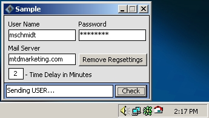



## ActiveX Mail Control

### Description

ActiveX email checking control. Checks and returns number of new messages, full source for control and sample applicaton included. Please vote =)
 
### More Info
 

             |
---                |---
**Submitted On**   |2001-01-31 12:36:56
**By**             |[michael schmidt](https://github.com/Planet-Source-Code/PSCIndex/blob/master/ByAuthor/michael-schmidt.md)
**Level**          |Advanced
**User Rating**    |4.8 (53 globes from 11 users)
**Compatibility**  |VB 6\.0
**Category**       |[OLE/ COM/ DCOM/ Active\-X](https://github.com/Planet-Source-Code/PSCIndex/blob/master/ByCategory/ole-com-dcom-active-x__1-29.md)
**World**          |[Visual Basic](https://github.com/Planet-Source-Code/PSCIndex/blob/master/ByWorld/visual-basic.md)
**Archive File**   |[CODE\_UPLOAD143711312001\.zip](https://github.com/Planet-Source-Code/michael-schmidt-activex-mail-control__1-14874/archive/master.zip)

